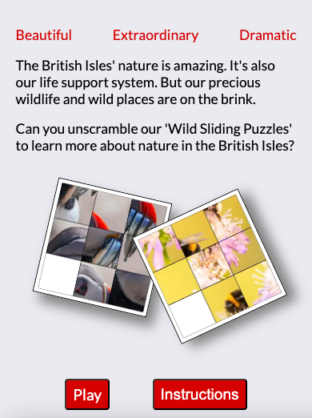
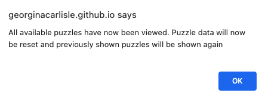

# Wild Sliding Puzzles
Developer: Georgina Carlisle

A fun, enjoyable and addictive sliding puzzle game that promotes wildlife and wild landscapes in the British Isles and the work being done through the 'Save Our Wild Isles' project. 

Users are faced with a scrambled image and need to slide the tiles around the grid in order to get all the tiles in their correct positions and thus reveal the picture. On completing the puzzle, users will be taken to a win page where they can learn more about the subject of the picture.

Link to live page: 
https://georginacarlisle.github.io/wild-sliding-puzzles-p2/

## Contents
[Features](#features)

[Design](#design)
- [The Strategy Plane](#the-strategy-plane)
- [The Scope Plane](#the-scope-plane)
- [The Structure Plane](#the-structure-plane)
- [The Skeleton Plane](#the-skeleton-plane)
- [The Surface Plane](#the-surface-plane)

[Testing and Validation](#testing-and-validation)

[Bugs and Fixes](#bugs-and-fixes)

[Deployment](#deployment)

[Adding additional puzzle images](#adding-additional-puzzle-images)

[Languages](#languages)

[Tools and technologies](#tools-and-technologies)

[Credits](#credits)

[Acknowledgements](#acknowledgements)

## Features

### Existing Features

The existing features provide the following project requirements:
- Fun and enjoyable puzzle (1)
- Promote UK wildlife and wild landscapes and the work being done through the ‘Wild Isles’ project (2, 3, 4, 5 + 6)
- Immediately clear what sort of puzzle this is, and its theme (7, 8 + 9)
- Clear instructions that are accessible at all points without disrupting the puzzle (10)
- Controls for the puzzle to be clear and easy to use (11 + 13)
- Puzzle to be achievable but still provide a level of challenge. The level of challenge should allow me to 
feel a sense of achievement on completion (16)
- Clear feedback when the puzzle has been completed (19)
- Option to choose a different puzzle (21)
- Extra help for the user if needed (24 + 25)
- Option to play again (27)
- A different puzzle on each subsequent game (28)
- Feedback to user when they have completed all available puzzles (29)
- Provide users with information about some of our incredible wildlife and what is happening right now (4, 6 + 19)
- Provide a link to further information about our ‘Wild Isles’ including how the user can help to make a 
difference (3 + 5)

#### Project Name

The project name (7) is displayed consistently at the top of all three pages.

#### Footer

The footer is displayed at the bottom of all pages. It has been styled to be sticky.

The footer includes:
- A link to the 'Wild Isles' project (3)
- All footer links open in a new tab

#### Landing page

The landing page includes:
- A short introductory paragraph (2)
- Static images of two jumbled sliding puzzle pictures (8) this is a slight deviation to the original plan. See user testing in TESTING.md for more information.
- Clearly visible buttons to access the instructions (10) and to play the game

#### Instructions modal (10)

The instructions modal can be accessed from both the landing page and the puzzle page. Clicking on the x in the top right corner causes the modal to disappear again.

#### Puzzle page 

The puzzle page includes:
- The sliding puzzle (1) with one of four pre-set scramble settings randomly chosen, ensuring that the puzzle is solvable (16)
- Three different puzzle images are currently available with logic in place to ensure user is given a different puzzle on each subsequent game (28)
- Images of UK wildlife are used for the puzzles (4)
- Clicking on a movable tile causes the tile to slide into the empty space (11) and in this manner the tiles can be manipulated one by one to move them into their correct position, this takes a number of moves. Clicking on further tiles is prevent while the sliding is happening.
- Clicking on an immovable tile triggers an alert informing the user that the tile cannot be moved (13)

- An additional alert has also been included to give feedback when the empty space is clicked

- Completion of the puzzle loads the win page (19)
- The 'Change puzzle' button resets the page with a different scrambled image (21)
- The 'Tips' button displays tips in a pop-up window (24)
- The 'Sneaky peek' button displays an image of the completed picture in a pop-up window (25) 
- An alert is triggered when the user has viewed all the available puzzles 

#### Sneaky peek modal

The sneaky peek modal (25) can be accessed from the puzzle page and displays an image of the completed puzzle. Clicking on the x in the top right corner causes the modal to disappear again.

#### Tips modal

The tips modal (24) can be accessed from the puzzle page and provides the user with step by step tips to help them 
complete the puzzle. Clicking on the x in the top 
right corner causes the modal to disappear again.

#### Win page

The win page (7) includes:
- The original image used to create the puzzle just completed (4)
- Further information about the picture subject (6)
- The 'play again' button takes the user back to the puzzle page where a new puzzle picture will be displayed (27)
- The 'learn more about our wild Isles' button opens the 'Save our Wild Isles' project in a seperate tab (5)
- An extra message displays once the user has cycled through all available puzzles. The button 'reset and play again' clears the session storage of puzzles seen and takes the user back to the puzzle page where they will now be shown puzzle picture they have already seen

#### Favicon and page titles

A favicon has been included (9) and each page has a different title.

#### Additional alerts

A number of additional alerts have also been programmed in case of future bugs, these alerts include:
- "puzzle pictures cannot be found, please contact developer"
- "scramble setting cannot be found, please contact developer"
- "tile not recognised, please contact developer"
- "Sneaky peek picture cannot be found, please contact developer"
- "puzzle completed not recoginsed, please contact developer"

[Return to contents list](#contents)

### Future Features

The following project requirement and associated features has not yet been met, please note this was always planned for future installments (see the scope plane):
- Option for sound effects and/or music to accompany the game
  - 20. Celebratory audio to play on completion of the puzzle
  - 22. Positive sound effect/slide sound effect on clicking a movable tile. Negative sound effect on clicking an immovable tile. User control to mute
[Return to contents list](#contents)
  - 23. Background music. User control to play

The following features are to be included in future installments and further build on project requirements that have already been met. With one exception (12), all were planned for future installments (see the scope plane):
- 12. Hovering over a movable tile will give feedback to the user to indicate it can be moved. This was planned for the first installment, however on balancing the time and code needed to add this feature against the increase in user values it was decided to leave it until future releases.
- 14. Keyboard arrows can be used to slide a tile corresponding to the direction of arrow pressed.
- 15. Clicking a keyboard arrow that doesn’t correspond to a movable tile will give feedback to indicate it cannot be moved.
- 17. Addition of a stopwatch to allow for personal challenge, how fast can you solve the puzzle? OR Addition of a set amount of time in which to complete the puzzle with easy, medium and hard settings.
- 28. Multiple puzzle images available with logic in place to ensure user is given a different puzzle on each subsequent game. Three puzzles are currently available, but more are planned (see Adding additional puzzle images, for instructions on how to add additional puzzle images)
- There are currently 4 scramble settings, again more are planned.

## Design

### The Strategy Plane

#### Users
The target audience enjoy solving puzzles. They may also be interested in wildlife, nature and our ‘Wild Isles’.

-	As a first-time user, I would like it to be immediately clear what sort of puzzle this is, and it’s theme.
-	As a first-time user, I would like clear instructions. These instructions should be accessible at all points without disrupting the puzzle.
-	As a first-time user, I want the controls for the puzzle to be clear and easy to use.
-	As a user, I want the puzzle to be achievable but still provide a level of challenge. The level of challenge should allow me to feel a sense of achievement on completion.
-	As a user, I want clear feedback when the puzzle has been completed.
-	As a user, I would like the option to choose a different puzzle.
-	As a user, I would like the option for sound effects and/or music to accompany the game.
-	As a user who is finding the puzzle difficult, I would like to be able to gain some extra help so that I can complete the puzzle. 
-	As a user who has completed a puzzle, I would like the option to play again. 
-	As a user who has completed a game, I would like to be shown a different puzzle on each subsequent game.
-	As a user who has completed multiple games, I would like to know once I have completed all available puzzles.

#### Owner

The owner is looking to:
- Provide a fun and enjoyable puzzle that will engage users.
-	Promote UK wildlife and wild landscapes and the work being done through the ‘Wild Isles’ project.
-	Provide users with information about some of our incredible wildlife and what is happening right now. 
-	Provide a link into further information about our ‘Wild Isles’ including how the user can help to make a difference.

[Return to contents list](#contents)

### The Scope Plane

The scope for this project explores the requirements of both user and owner, and how these could be met. Following an agile approach, the project features have then been split into sprints. The first sprint aims to keep time and other resources to a minimum whilst ensuring that the project is viable and provides enough value and an excellent user experience that will leave early users keen to return.

| Requirement | Feature | sprint |
| -- | -- | -- |
| Fun and enjoyable puzzle | 1. Functioning sliding puzzle | 1st - single puzzle, 2nd onwards - more puzzles added |
| Promote UK wildlife and wild landscapes and the work being done through the ‘Wild Isles’ project | 2. Short introductory paragraph on the landing page | 1st |
| | 3. Link to the ‘Wild Isles’ project in the footer | 1st |
| | 4. Images of UK wildlife used for the puzzles | 1st |
| | 5. Link to the ‘Wild Isles’ project on the win page | 2nd |
| | 6. Further information about the picture subject on the win page | 2nd |
| Immediately clear what sort of puzzle this is, and its theme | 7. Page title: Wild Sliding Puzzles | 1st |
| | 8. Static Image of a jumbled sliding puzzle on the landing page | 1st |
| | 9. Design of favicon | 1st |
| | Also see features 2 and 3 | 1st |
| Clear instructions that are accessible at all points without disrupting the puzzle | 10. Clearly visible button to access the instructions on both the landing page and the game page. Instructions are then displayed in a pop-up window. | 1st |
| Controls for the puzzle to be clear and easy to use | 11. Clicking on a movable tile will give feedback and cause the tile to slide into the empty space | 1st |
| | 12. Hovering over a movable tile will give feedback to the user to indicate it can be moved | 1st |
| | 13. Clicking on an immovable tile will give feedback to indicate it cannot be moved | 2nd |
| | 14. Keyboard arrows can be used to slide a tile corresponding to the direction of arrow pressed. | 3rd |
| | 15. Clicking a keyboard arrow that doesn’t correspond to a movable tile will give feedback to indicate it cannot be moved. | 3rd |
| Puzzle to be achievable but still provide a level of challenge. The level of challenge should allow me to feel a sense of achievement on completion | 16. Pre-set scramble settings to ensure that the puzzle is solvable | 1st |
| | 17. Addition of a stopwatch to allow for personal challenge, how fast can you solve the puzzle? OR Addition of a set amount of time in which to complete the puzzle with easy, medium and hard settings. | 3rd |
| Clear feedback when the puzzle has been completed | 18. Win message given on completion of the puzzle | 1st |
| | 19. Completion of the puzzle loads a win page. Also see features 5 + 6 | 2nd (replaces feature 18)|
| | 20. Celebratory audio to play on completion of the puzzle | 3rd |
| Option to choose a different puzzle | 21. Clearly visible button on the game page will reset the page with a different scrambled image | 2nd |
| Option for sound effects and/or music to accompany the game | 22. Positive sound effect/slide sound effect on clicking a movable tile. Negative sound effect on clicking an immovable tile. User control to mute | 3rd |
| | 23. Background music. User control to play | 3rd |
| Extra help for the user if needed | 24. Clearly visible button on the game page will display tips in a pop-up window | 1st |
| | 25. Clearly visible button on the game page will display an image of the completed picture | 1st |
| Option to play again | 26. Win message (feature 18) comes with an option to play again | 1st |
| | 27. Clearly visible button that resets the game page with a different scrambled image. Available on the win page (feature 19) | 2nd (replaces feature 26) |
| A different puzzle on each subsequent game | 28. Multiple puzzle images available with logic in place to ensure user is given a different puzzle on each subsequent game | 2nd |
| Feedback to user when they have completed all available puzzles | 29. Extra message on Win page once user has cycled through all available puzzles. Option to reset and play the puzzles again | 2nd |
| Provide users with information about some of our incredible wildlife and what is happening right now | see features 4, 6 + 20 | 2nd |
| Provide a link to further information about our ‘Wild Isles’ including how the user can help to make a difference | See features 3 + 5 | 1st (3) and 2nd (5) |

[Return to contents list](#contents)

### The Structure Plane

Wild Sliding Puzzles will consist of two pages initially – A landing page and a puzzle page. A win page will be added as part of the 2nd sprint. 

The following pop-ups will also be created to house extra information, which can then be viewed without disrupting the puzzle: Instructions, Tips and Sneeky Peek (image of completed puzzle).

Navigation will be provided through clearly visible buttons and a footer will be placed at the bottom of all pages.

#### Site architecture

Landing Page
-	Wild Sliding Puzzles title
-	Short intro about UK wildlife
-	Introduction to the puzzle
-	Static Image of a jumbled sliding puzzle
-	Button to take user to the puzzle page
-	Button to bring up instructions pop-up
-	Footer with developer details and link to the ‘Wild Isles’ project

Puzzle Page
-	Wild Sliding Puzzles title
-	Sliding puzzle game 
-	Button to change the puzzle (2nd Sprint)
-	Button to bring up tips pop-up
-	Button to bring up sneeky peek pop-up
-	Button to bring up instructions pop-up
-	Footer with developer details and link to the ‘Wild Isles’ project

Win Page (2nd Sprint)
-	Wild Sliding Puzzles title
-	Information linked to the subject of the puzzle that has been solved
-	Button to play again
-	Button to take user to the ‘Wild Isles’ website, external link

[Return to contents list](#contents)

### The Skeleton Plane

The following wire frames show the intended design of each of the three pages when viewed on a smart phone and on a desktop computer.

#### Landing Page

#### Puzzle Page

#### Win Page (2nd Sprint)

#### Pop-ups

The following wireframes show the instructions pop-up when activated from the puzzle page. The Tips and Sneeky Peek pop-ups will be very similar.

[Return to contents list](#contents)

### The Surface Plane

#### Colour Scheme

Inspiration for the colour scheme came from the colours in the Puffin puzzle picture, with colours then being used to provide contrast to increase user experience by aiding readability and navigation.

Main colour scheme:
**A**: Page background colour
**B**: Main heading
**C**: Key words on the landing page and button background (text on buttons is white #FFFFFF)
**D**: Footer background colour
**E**: Footer anchor link icons (slightly different to the main heading colour in order to increase contrast to the footer background)
All text unless specified is black #000000

Modal colour scheme:
**A**: Page background colour (included for reference)
**B**: Modal background colour
**C**: Heading
**D**: Subheading
All text unless specified is black #000000

Please go to testing.md to see colour contrast checks.

#### Typography

The font [Kaushan Script by Impallari Type](https://fonts.google.com/specimen/Kaushan+Script?preview.size=22&query=Kaushan+Script) has been used for the main heading. This was chosen as I thought it stood out well and looked a little on the wild side!

The font [Lato by Lukasz Dziedzic](https://fonts.google.com/specimen/Lato?preview.size=22&query=%C5%81ukasz+Dziedzic&category=Sans+Serif) has been been used for all other text. It is a sans-serif font and has been chosen to aid readability as well as working well with Kaushan Script and being visually appealing.

[Return to contents list](#contents)

## Testing and Validation

See [TESTING.md](TESTING.md) for all testing and validation

[Return to contents list](#contents)

## Bugs and fixes

The original picture div used on the win page wasn't maintaining an aspect ratio of 1/1 leaving a white gap at the bottom of the container below the image.

CSS associated with the div (the image was set a width of 100% and an original aspect ratio of 1/1)

An example of box model once all css rules applied

I tried the following ways to fix this bug, none of these worked:
- aspect-ratio
- object-fit

In the end I resolved the bug by giving the div a fixed width and height, which I then increase using media queries for bigger screens.

[Return to contents list](#contents)

## Deployment

[Return to contents list](#contents)

## Adding additional puzzle images

Follow these steps to add an additional puzzle image:

1 - Resize the image you want to use to 750px x 750px. Save your original image to the repo.

2 - Split the image into 9 equal tiles each 250px x 250px. Save your tile images to the repo.

3 - The following steps are in the puzzleScript.

4 - In the chooseGamePicture function, adjust the following lines of code. Increasing the number multiplying by, by 1. 
let pictureNumber = Math.floor(Math.random() * 1);
pictureNumber = Math.floor(Math.random() * 1);

5 - In the setGamePicture function, create a new case (this should be numbered one more than the last case).

6 - Following the format of previous cases add in the links to your tiles. Make sure to leave the seventh slot as an empty temporal literal. Choosing a different tile space to be empty could result in insolvable puzzles.

7 - Disable the checkWin function. Load the page and solve the puzzle to take a screenshot of the completed puzzle. Save your sneaky peak image to the repo and re-enable checkWin.

8 - In the sneakyPeek function, create a new case and following the format of previous cases add in the link to your sneaky peek image.

9 - The remaining steps are in the winScript

10 - In the loadPuzzlePicture function, create a new case and following the format of previous cases add in the link to your original image.

11 - In the loadPuzzleName function, create a new case and following the format of previous cases add in the name of your image's subject.

12 - In the loadPuzzleInformation function, create a new case and following the format of previous cases add in information about the subject of your image.

13 - In the checkPuzzlesCompleted function, adjust the following line of code increaing the number by 1.
if (completedPuzzleNumbers.length === 2)

14 - All done and ready for testing.

[Return to contents list](#contents)

## Languages

- HTML
- CSS
- JavaScript

[Return to contents list](#contents)

## Tools and Technologies

- VScode: Used for writing, previewing and pushing the code to git hub
- Git: Used for version control
- Git hub: Used to store the repository for this project
- Git hub pages: Used to deploy the website
- [Balsamiq](https://balsamiq.com/): Used for creating the wireframes
- PhotoScape X: Used to crop original image to make the tiles needed for the puzzle, as well as to resize all images as needed.
- [Adobe](https://color.adobe.com/create/color-wheel) - Used to create the image showing the colour scheme.
- Chrome Developer tools - Used throughout the development of this project to view and adjust CSS style rules, to see console logs, to monitor session storage and to test performance using lighthouse.
- [Nu Html Checker](https://validator.w3.org/nu/) - Used to test the HTML code
- [W3C CSS Validation Service](https://jigsaw.w3.org/css-validator/) - Used to test the CSS code
- [Jshint](https://jshint.com/) - Used to test the JavaScript code
- [Wave web accessibility evaluation tool](https://wave.webaim.org/) - Used to test accessibility
- [WebAim contrast checker](https://webaim.org/resources/contrastchecker/) - Used to test contrast between text and background
- [Responsive Web Design Checker](https://responsivedesignchecker.com) - Used to check responsivity across a range of devices and screen sizes
- [Am I responsive](https://ui.dev/amiresponsive) - Used to create the image displayed at the beginning of the readme
- [Favicon.cc](https://www.favicon.cc/) - Used to create the favicon
- [Google Fonts](https://fonts.google.com/) - Used to choose and download fonts
- [Font Awesome](https://fontawesome.com/) - Used to download the icons used as part of the footer 

[Return to contents list](#contents)

## Credits

### Code
- **HTML, CSS and JavaScript code used to create modals**: I followed the steps given in the article [How To - CSS/JS Modal by W3 Schools](https://www.w3schools.com/howto/howto_css_modals.asp) to create the modals used within this project, adjusting the code to meet my requirements.
- **Link code for favicon**: Code copied from [Favicon.cc](https://www.favicon.cc/) I then added in the file path for the image.
- **Link code and incode references for Font Awesome icons**: Code copied from [Font Awesome](https://fontawesome.com/) 

### Fonts
- **Kaushan Script**: Created by Impallari and downloaded from [Google Fonts](https://fonts.google.com/specimen/Kaushan+Script?preview.size=22&query=Kaushan+Script). Used for the main heading.
- **Lato**: Created by Lukasz Dziedzic and downloaded from [Google Fonts](https://fonts.google.com/specimen/Lato?preview.size=22&query=%C5%81ukasz+Dziedzic&category=Sans+Serif). Main font used throughout. 

### Images
- **Original images of the Puffin, Bee and Ancient Oak**: from [Save our Wild Isles](https://www.saveourwildisles.org.uk/). All other images used on the site were created from these 3 original images.
- **Font awesome icons** used in the footer: by [Font Awesome](https://fontawesome.com/)
- **Favicon image**: Created using [Favicon.cc](https://www.favicon.cc/)
- **Responsive site image**: Created through the website [Am I responsive](https://ui.dev/amiresponsive)

### Text
- **Key words** on the landing page: from [BBC-Wild Isles](https://www.bbc.co.uk/programmes/p0f0t5dp)
- **First intro paragraph** on the landing page: from [Save our Wild Isles](https://www.saveourwildisles.org.uk/)
- **Information text** on the win page: from [Save our Wild Isles](https://www.saveourwildisles.org.uk/)

[Return to contents list](#contents)

## Acknowledgements

Sean from Code Institutes tutor support - For helping me to find the best way to prevent the tileSwap function from activating until the slide animation was complete. For also pointing out a future bug and the need to also prevent the click event listener from calling the tileClicked function until the tile slide and swap had completed.

### Websites, articles and tutorials

[A Complete Guide to CSS Grid - CSS Tricks](https://css-tricks.com/snippets/css/complete-guide-grid/) - My knowledge and understanding of CSS grid and how to use it was picked up from this article.

[grid-area - mdn web docs](https://developer.mozilla.org/en-US/docs/Web/CSS/grid-area) - I gained further understanding of the grid-area property and how to use correctly from this article.

[How to Aspect Ratio - W3 Schools](https://www.w3schools.com/howto/howto_css_aspect_ratio.asp) - I used this article to find a way to set the height of my grid boxes relative to the width so that the box had an aspect ratio of 1:1.

[JavaScript HTML DOM EventListener - W3 Schools](https://www.w3schools.com/js/js_htmldom_eventlistener.asp) - I learnt how to pass on a parameter as part of the eventlistener through this article.

[Asynchronous JavaScript - W3 Schools](https://www.w3schools.com/js/js_asynchronous.asp) - I found this article helpful in understanding how to implement the TimeOut method.

[Window: sessionStorage property - mdn web docs](https://developer.mozilla.org/en-US/docs/Web/API/Window/sessionStorage) - I found this article helpful in learning how to store information that can then be used by different pages within the same tab.

[Window sessionStorage - W3 Schools](https://www.w3schools.com/jsref/prop_win_sessionstorage.asp) - I found this article helpful in learning how to store information that can then be used by different pages within the same tab.

[View and edit session storage - Chrome Developers](https://developer.chrome.com/docs/devtools/storage/sessionstorage/#:~:text=%23%20View%20sessionStorage%20keys%20and%20values,Expand%20the%20Session%20Storage%20menu.&text=Click%20a%20domain%20to%20view%20its%20key%2Dvalue%20pairs.&text=Click%20a%20row%20of%20the,the%20viewer%20below%20the%20table) - I found this article helpful in learning how to track the data being stored in session storage.

[JavaScript String search() - W3 Schools](https://www.w3schools.com/jsref/jsref_search.asp) - This article showed me how to check for a match within a string without needing to iterate through the string.

[Window: open() method - mdn web docs](https://developer.mozilla.org/en-US/docs/Web/API/Window/open) - I learnt about using javascript to open a new window and how to control where and how it opens from this article.

[Get the last Character of a String in JavaScript - Borislav Hadzhiev](https://bobbyhadz.com/blog/javascript-get-last-character-of-string#:~:text=To%20get%20the%20last%20character,last%20character%20of%20the%20string.) - I learnt how to quickly find the last character in a string from thos blog.

[Return to contents list](#contents)
