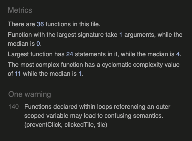
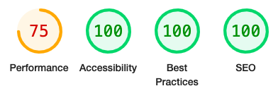

# Testing for 'Wild Sliding Puzzles'
Developer: Georgina Carlisle

## Contents

[Code Validation](#code-validation)
- [HTML Validation](#html-validation)
- [CSS Validation](#css-validation)
- [JavaScript Validation](#javascript-validation)

[Performance](#performance)

[Accessibility Testing](#accessibility-testing)

[Browser Testing](#browser-testing)

[Reponsive Testing](#reponsive-testing)

[User Testing](#user-testing)

[Manual Testing](#manual-testing)

## Code Validation

### HTML Validation

#### Index.html

##### Initial error

I fixed this error by removing the offending / from the favicon link in all HTML pages

#### Puzzle.html

Warning left in this instance. Aria-label used to provide an explanation of the puzzle grid which cannot be ascertained from the html.

##### Initial error

I fixed this error by removing the image element from the HTML document and instead creating an empty div into which the puzzleScript.js now inserts the full image element instead of just updating the src.

#### Win.html

[Return to contents list](#contents)

### CSS Validation

[Return to contents list](#contents)

### JavaScript Validation

#### IndexScript.js

##### Initial errors for indexScript.js

I fixed these errors by inserting the missing semicolons in lines 6 and 22

#### PuzzleScript.js

Warning left in this instance as performance and function of the puzzle is not effected with no errors or warnings brought up during any other testing.

##### Initial errors for puzzleScript.js

I fixed these errors by:

- inserting the missing semicolons in lines 18, 65, 559. 581 and 603

- removing the line breaks before the && and placing after instead, lines 497 - 505

#### WinScript.js

##### Initial errors for winScript.js

I fixed these errors by inserting the missing semicolons in lines 63 and 136

[Return to contents list](#contents)

## Performance

### Initial performance measures

Performance scores for win.html on desktop and all pages on mobile were initially quite low

#### Index.html on mobile

Steps taken to improve performance:
- Reduce image size of landing-page-1.webp and landing-page-2.webp

#### Puzzle.html on mobile

#### Win.html on desktop and mobile
Desktop:

Mobile:

Steps taken to improve performance:
- Reduce image size of all original pictures

[Return to contents list](#contents)

## Accessibility Testing

#### Wave report for the landing page

#### Wave report for the puzzle page

#### Wave report for the win page

[Return to contents list](#contents)

## Browser Testing

[Return to contents list](#contents)

## Reponsive Testing

[Return to contents list](#contents)

## User Testing

[Return to contents list](#contents)

## Manual Testing

[Return to contents list](#contents)