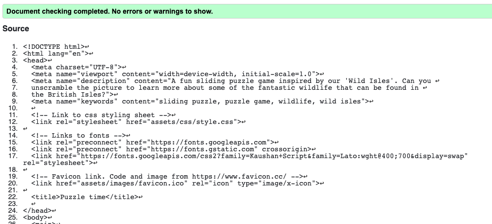
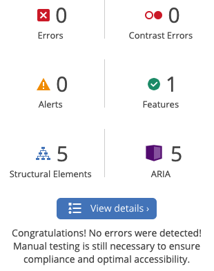

# Testing for 'Wild Sliding Puzzles'
Developer: Georgina Carlisle

## Contents

[Code Validation](#code-validation)
- [HTML Validation](#html-validation)
- [CSS Validation](#css-validation)
- [JavaScript Validation](#javascript-validation)

[Performance](#performance)

[Accessibility Testing](#accessibility-testing)

[Browser Testing](#browser-testing)

[Reponsive Testing](#reponsive-testing)

[User Testing](#user-testing)

[Manual Testing](#manual-testing)

## Code Validation

### HTML Validation

#### Index.html

##### Initial error

I fixed this error by removing the offending / from the favicon link in all HTML pages

#### Puzzle.html

Warning left in this instance. Aria-label used to provide an explanation of the puzzle grid which cannot be ascertained from the html.

##### Initial error

I fixed this error by removing the image element from the HTML document and instead creating an empty div into which the puzzleScript.js now inserts the full image element instead of just updating the src.

#### Win.html

[Return to contents list](#contents)

### CSS Validation

[Return to contents list](#contents)

### JavaScript Validation

#### IndexScript.js

##### Initial errors for indexScript.js

I fixed these errors by inserting the missing semicolons in lines 6 and 22

#### PuzzleScript.js

Warning left in this instance as performance and function of the puzzle is not effected with no errors or warnings brought up during any other testing.

##### Initial errors for puzzleScript.js

I fixed these errors by:

- inserting the missing semicolons in lines 18, 65, 559. 581 and 603

- removing the line breaks before the && and placing after instead, lines 497 - 505

#### WinScript.js

##### Initial errors for winScript.js

I fixed these errors by inserting the missing semicolons in lines 63 and 136

[Return to contents list](#contents)

## Performance

### Initial performance measures

Performance scores for win.html on desktop and all pages on mobile were initially quite low

#### Index.html on mobile

Steps taken to improve performance:
- Reduce image size of landing-page-1.webp and landing-page-2.webp

#### Puzzle.html on mobile

#### Win.html on desktop and mobile
Desktop:

Mobile:

Steps taken to improve performance:
- Reduce image size of all original pictures

[Return to contents list](#contents)

## Accessibility Testing

#### Wave report for the landing page

#### Wave report for the puzzle page

#### Wave report for the win page

#### Contrast checker

Normal text on page background

Heading text on page background

Sub-heading text on page background

Button text on button background

Hover button text on button background

Text on footer background

Link Icon on footer background

Normal text on modal background

Heading text on modal background

[Return to contents list](#contents)

## Browser Testing

[Return to contents list](#contents)

## Reponsive Testing

[Responsive Web Design Checker](https://responsivedesignchecker.com) was used to test responsivity across all the following devices and their associated screen sizes. Changes to base styling and web queries were added in response to testing. 

Desktop testing - Screen shot shows 24" Desktop, please note the left hand side of the window is obscurred by the menu.

Tablet testing - Screen shot shows Samsung Galaxy Tab 10

Mobile testing -Screen shot shows Apple iPhone 3/4/4s

[Return to contents list](#contents)

## User Testing

### During development
The project was deployed to git hub pages early on, as soon as the puzzle was working and tested by myself and close family throughout the remaining development.

The following observation was brought up:
- The initial idea to have a single image of a scrambled puzzle on the landing page was confusing. It lead the user to believe that this might be the puzzle and they attempted clicking on the tiles to have a go. In response, I created an image showing two different scrambled puzzles, rotated at an angle and overlapping. This image did not then give the impression that it was the actual puzzle.

### On completion
The site was tested by numerous friends and family using various devices on completion and was also posted on the peer-code-review slack channel.

Response from all users at this point was good with no comments as to any need for change or improvement.

[Return to contents list](#contents)

## Manual Testing

The site has been extensively tested, while most of this has occured within a chrome browser on a Macbook and on an iphone, it has also been fully tested in all browsers mentioned earlier and on a oneplus phone.

### External links
All external links have tested. These include the footer links and the 'Learn more about our Wild Isles' button on the win page.

They all open in separate tabs and respond to hover, changing colour.

### Internal links
All internal links have been tested. 

These include the following buttons 'play' on the landing page, 'change puzzle' button on the puzzle page and 'play again' on the win page. All buttons take the user to the correct page opening in the same tab and respond to hover, changing colour.

This also includes an automatic link to the win page when the user completes the puzzle. This has been tested on multiple occasions for different puzzles.

### Modals
All modals have been tested. These include the 'instruction model' on both the landing page and the puzzle page, and the 'sneaky peek' and 'tips' modals on the puzzle page. 

All modals open when the user clicks on associated button and close when the user clicks on the x in the top right corner.

The 'sneaky peek' modal opens with a picture matching the puzzle being completed at the time.

### Puzzle loading
The puzzles have been loaded multiple times using the 'change puzzle' button, from the 'play again' button and by refreshing the browser tab.

On the first load, one of the three puzzles is randomly chosen and randomly scrambled.

On the second load, one of the remaining two puzzles is randomly chosen and randomly scrambled.

On the third load, the remaining puzzle is loaded and randomly scrambled. Due to the nature of the code, it is possible at this point that one of the puzzles may be re-chosen. However, this is very unlikely as the loop for this function has 100 iterations to randomly select the 3rd number. At no point during testing has a puzzle been re-chosen.

On the fourth load, the user is alerted saying "All available puzzles have now been viewed. Puzzle data will now be reset and previously shown puzzles will be shown again" at ths point the puzzle data is deleted and the above cycle begins again.

### Puzzle Functionality
The following puzzle functionality has been fully tested:
- Clicking on a movable tile causes it to appear to slide into the empty space. A short animation is triggered followed by switching of the tiles, with timing making the move seemless and imperceptible.
- Clicking on another tile while the first is still moving does not trigger another slide. As soon as the tile has switched into position a new click is enabled.
- Clicking on a tile that is not above, below or next to the empty space results in an alert to the user and no movement of the tiles.
- Clicking on the empty space results in an alert to the user and no movement of the tiles.
- The win is automatically triggered as soon as the puzzle tiles are in the correct position. There is a slight pause to allow the user to appreciate the fact that the picture is no fully assembled before the win page is loaded.
- All puzzles are solvable with the scramble setting fully tested using homemade pieces before the code is written and added to the game, as well as being fully tested in the game itself.

### Loading of the win page

The game has been completed multiple times and each time when the last puzzle piece slots into its correct position:
- The win page is loaded.
- The original image for the completed puzzle is loaded.
- The image subject of the puzzle completed is referenced.
- The information linked to the puzzle selected is loaded.

When all the puzzles have been seen the following also occurs:
- The 'play again' changes to 'Reset and play again'
- On clicking, the puzzle data is reset and previously shown puzzles are randomly selected again.
- A message is also added above the button reading "You have now seen all the available puzzles. Did you manage to solve them all?"

[Return to contents list](#contents)